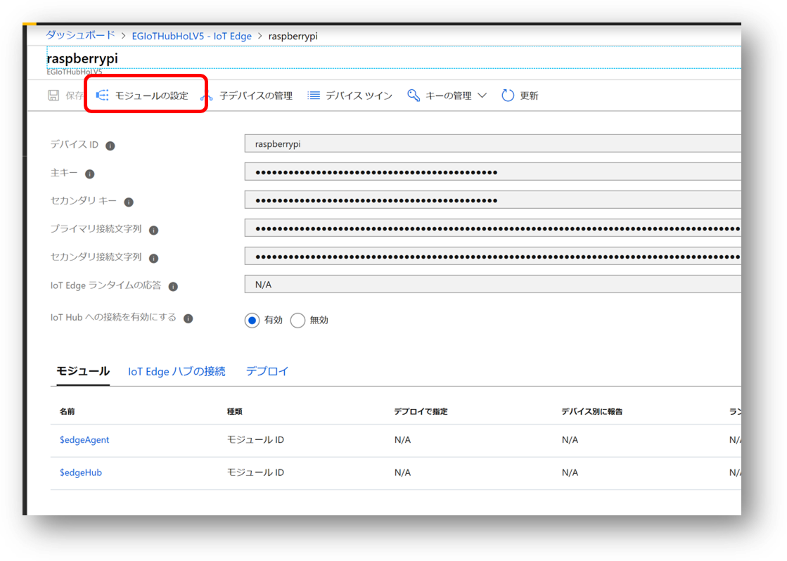
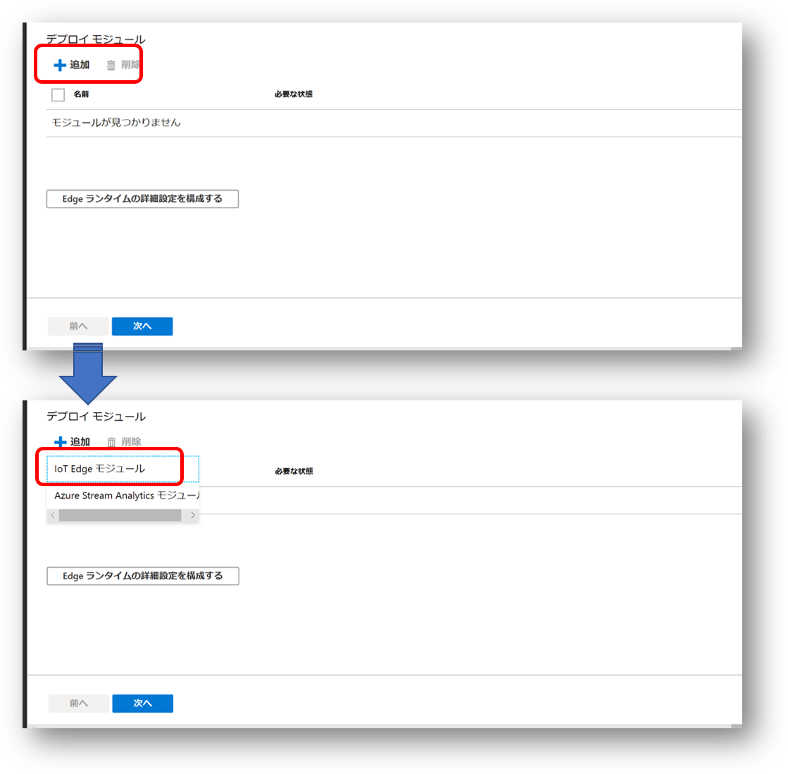
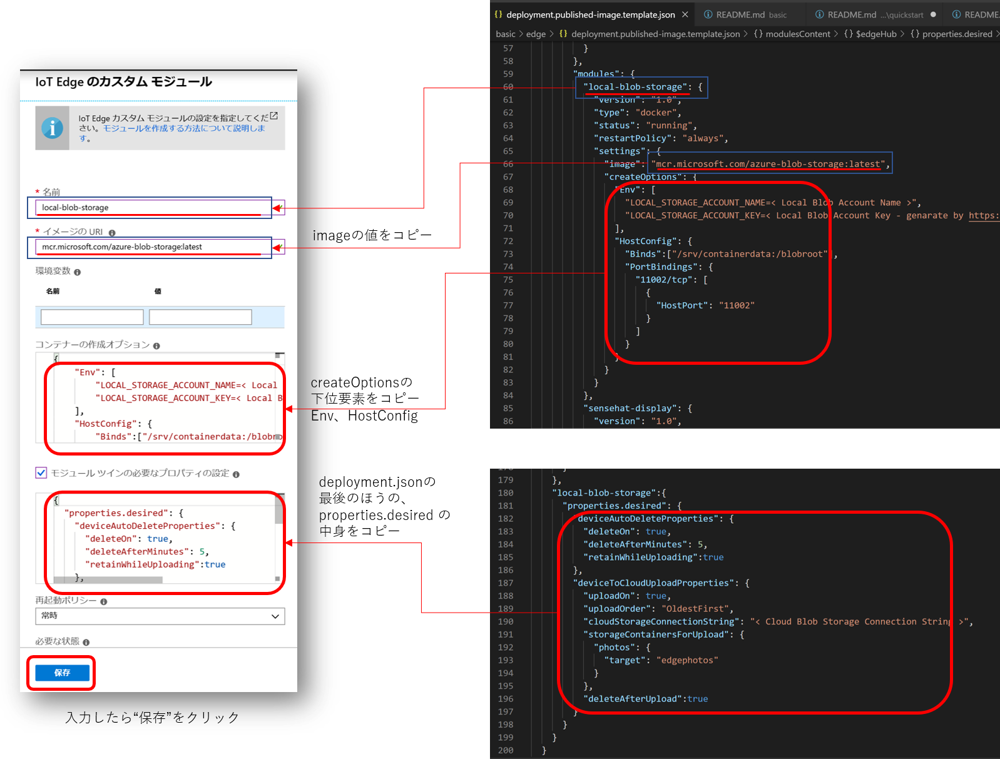
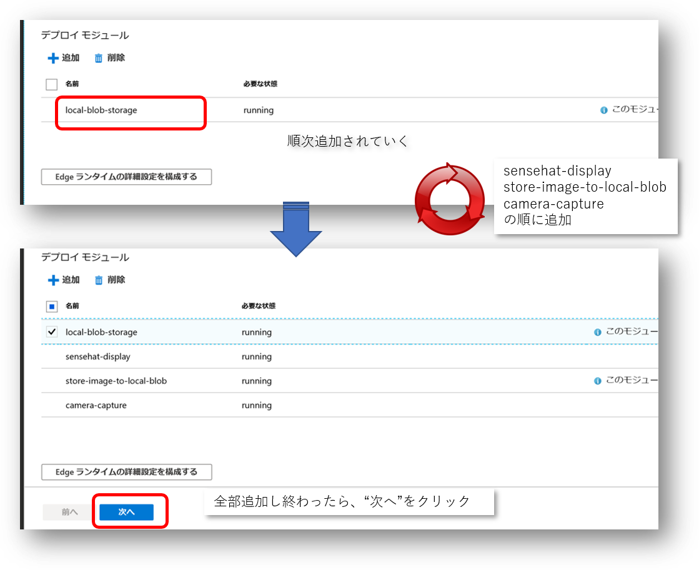
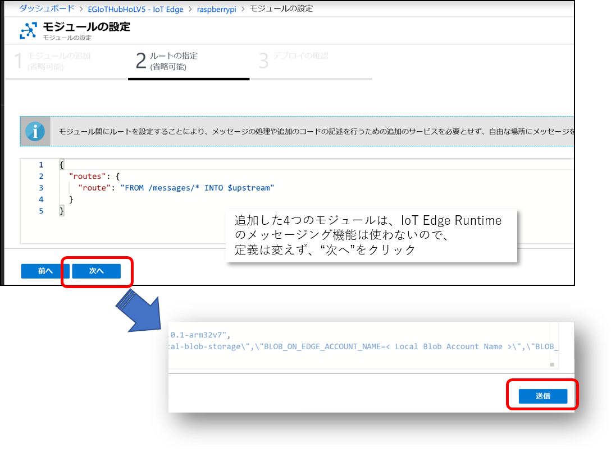

# Azure Portal で、Edge Moduleを設定する  
まず、Azure Portalで、設定したいIoT Edgeデバイスを表示する。 
”モジュールの設定” をクリックする。
 
"+追加”をクリックして配置するモジュールを順番に定義していく。”IoT Edge モジュール” を選択

[deployment.published-image.template.json](/basic/edge/deployment.published-image.template.json) の内容を元に各モジュールを設定し、追加していく。 

※ Blob on Edge 周りの設定など、適宜各自の環境で設定すること。  
全モジュール追加したら、

”次へ”をクリック。 

特にメッセージングの設定は必要ないので、そのまま”次へ”をクリックし、”送信”をクリック。  
これで、ラズパイにモジュール配置情報が送られ、IoT Edge Runtime が指定されたImageをPullして実行する。 

ポータルの表示は、各モジュールの実行状況の表示に代わる。 
 
