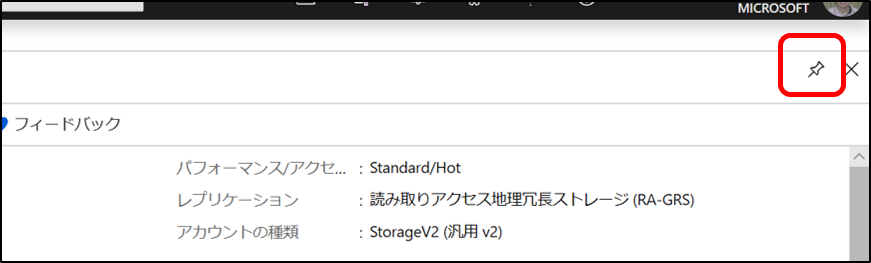

# Azure Portal ダッシュボードの使い方 
[参考ドキュメント](https://docs.microsoft.com/ja-jp/azure/azure-portal/azure-portal-dashboards) 

Azure Portal のダッシュボードを効果的に利用し、学習、実証実験、開発、運用を効率化する。 
## ダッシュボードでできること  
- ソリューションを構成するリソース（PaaS等）の一覧表示 
  - 目的とするリソースへのアクセスの効率化 
  - リソースのモニタリングの一覧表示 
- 複数人で一つのダッシュボードを共有することにより、共同開発、作業を支援 

## ダッシュボード構成の基本的な考え方 
大抵の場合、一つのソリューションは、一つのリソースグループに所属するので、 
一つのリソースグループごとにダッシュボードを用意し、そのリソースグループに属するリソースをダッシュボードにピン留めし、データの依存関係に大体合致するようにタイルを並べると分かりやすい。 

## ダッシュボードの操作方法 
- [ダッシュボードの作成](https://docs.microsoft.com/ja-jp/azure/azure-portal/azure-portal-dashboards#create-a-new-dashboard) 
- [ダッシュボードの編集 - リソースの追加、配置変更など](https://docs.microsoft.com/ja-jp/azure/azure-portal/azure-portal-dashboards#edit-a-dashboard) 
- [ダッシュボードの共有](https://docs.microsoft.com/ja-jp/azure/azure-portal/azure-portal-dashboards#edit-a-dashboard) 

## ダッシュボード利用時のリソース作成とダッシュボードのピン留め 
Azure Portal でダッシュボードを使ってソリューションを開発する場合には、以下の手順で作業を進めると効率的。 
このハンズオンのコンテンツでは、リソース作成時は特段の説明がない限り、この流れでリソースを作成してください。 
1. 先ずダッシュボードを作成する 
2. リソースグループを作成し、ダッシュボードにピン留めする 
3. リソースグループをクリックしてリソースグループの詳細を表示する 
4. リソースグループの詳細で、リソースを作成し、ダッシュボードにピン留めする 

以下図で流れを説明しよう。 
ダッシュボード作成後（ダッシュボードの名前は任意）、以下の図に従って作業を進める。

### リソースグループの作成とピン留め 
 
- リソースグループに名前を付ける。※名前は使用可能な文字列で任意（使いやすい名前を） 
- リージョンを選択 ※用途に応じて適切な場所を選択 
- ”確認及び作成”をクリック 

 
- 入力を確認して、”作成”をクリック 
- 作成が終わったら、右上に表示されるパンの”ダッシュボードにピン留め”をクリック 

これで、作成されたリソースグループがダッシュボード上に表示される。 
 

### リソースの作成 
リソースグループに属するリソースが無い場合は、この”リソースグループ”をクリックし、リソースを作成するのが便利。 

リソースの作成は、以下の画面の検索欄で、作成したリソースの種類を入力する。途中まで入力すると候補が表示されるので、それを選択する。 
※図の場合は、Storage Account 
 
作成に必要な設定はそれぞれのリソースで異なるので、それぞれのケースに従って入力し作成する。作成が終わったら、右上にダッシュボードへのピン留めを促す表示が出るので、ピン留めしておく。  
※ピン留めを忘れても、リソースの詳細ページを表示して、右上のピンをクリックすれば後からダッシュボードへのピン留めが可能  
  

リソースを作成すると、ダッシュボードにピン留めされたリソースグループに、作成したリソースがリスト表示される。 
 

2個目以降のリソース作成は、一旦、ダッシュボードにピン留めされたリソースグループのタイルをクリックして、リソースグループの詳細を表示し、以下の図のように、”＋追加”ボタンをクリックして作成できる。 
 
”＋追加”をクリックしたら、リソース種類の選択画面が表示される。 
