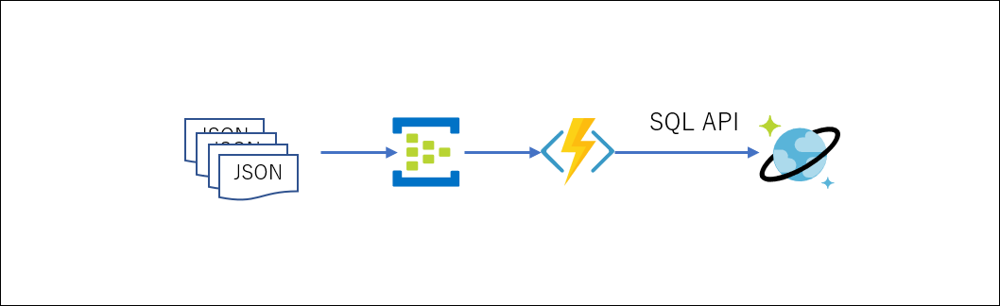

# Event Hub で受信したメッセージをCosmosDBに蓄積する
IoT では、時系列データを Stream Analytics や ML で処理するなどした結果を Event Hub に受けて、そのデータを別のサービスに転送するパターンが良く使われる。ここでは、Event Hubで受信したデータ（JSON）を Azure のサーバーレスなロジック実行機構の Azure Functions を使って、CosomoDB に格納する方法を例示する。 


---
## 準備  
[VS Codeによる開発環境セットアップ方法](https://docs.microsoft.com/ja-jp/azure/azure-functions/functions-create-first-function-vs-code?pivots=programming-language-csharp#configure-your-environment)を参考に、Windows PC や Mac 上に開発環境尾セットアップする。 

---
## Azure リソースの作成 
以下の3つのリソースを、順番に作成していく。 
- [Event Hub](#event-hub-の作成) 
- [Cosoms DB](#cosmos-db-の作成) 
- [Azure Function](#azure-function-の作成)

---
### Event Hub の作成 
このシナリオではデータを受信しているEvent Hub は既に存在しているはず（参考までに [Event Hub の作成方法はこちら](https://docs.microsoft.com/ja-jp/azure/event-hubs/event-hubs-create)）なので、注意点を述べる。  
Azure Function が Event Hub からデータを受信できるようにするために、[Event Hub コンシューマー向けのSASによる認証](https://docs.microsoft.com/ja-jp/azure/event-hubs/authenticate-shared-access-signature#authenticating-event-hubs-consumers-with-sas) を参照して、Azure Function にバインドされる Event Hub に”リッスン”権限を持つ共有アクセスポリシーを作成する。  
※ 共有アクセスポリシーは、Event Hubs 名前空間と、各 Event Hub 両方で定義できるので、気を付けること。ここでは各 Event Hub の共有アクセスポリシーが対象！  
作成したアクセスポリシーの接続文字列（プライマリーでもセカンダリーでもどちらでも可 - 作成したアクセスポリシー項目をクリックすると表示される） を、Azure Functions のバインディングで利用するのでどこか適当なところにコピペしておくこと。

---
### Cosmos DB の作成 
[Azure Cosmos DB のアカウント作成](https://docs.microsoft.com/ja-jp/azure/cosmos-db/create-cosmosdb-resources-portal)を参考に、Cosmos DBを、<b>"SQL API"</b> で作成する。データベース名は任意ではあるが、以下、<b>"SensorData"</b>という名前でデータベースを作成したものとする。他に、コンテナ―名、パーティションキーは、それぞれ、<b>"Sensors"</b>、<b>"deviceid"</b> で作成するものとして記述する。  
※ Event Hub で受信している JSON データに、パーティションキーとして適当なプロパティがあれば、そのプロパティ名を使用すること。  
作成が終わったら、ポータル左のペインの”キー”をクリックして、接続文字列をどこか適当なところにコピペしておく。  
※ 接続文字列は、Azure Functions のバインディングで後ほど利用する。

---
### Azure Function の作成  
Azure Function 拡張をインストールした VS Code でロジックを作成し、デバッグ、デプロイを行う。基本的な作業の流れを[こちら](https://docs.microsoft.com/ja-jp/azure/azure-functions/functions-create-first-function-vs-code?pivots=programming-language-csharp)を参照して把握しておくこと。  
※ 本 Tips では、言語は C# を用いている。C#知らねーし的な方もいるかと思うが、大したロジックではないのであえて別の言語で苦労せず、C# でお試しあれ。  

#### Azure Function プロジェクトの作成 
VS Code コマンドパレットで  
<b>Azure Functions : Create New Project...</b>  
を選択し、<b>"C#"</b> で、 <b>"Event Hub Trigger"</b> を選択してプロジェクトを作成する。  

#### Cosmos DB への書き出し用バインディングの追加  
生成されたコードは、 Event Hub にメッセージが受信されたことをトリガーに、 Azure Function をコールするバインディングしかないので、Cosmos DB への出力用バインディングを追加する。  
まずは、VS Code のターミナルで以下を実行する。  
```
dotnet add package Microsoft.Azure.WebJobs.Extensions.CosmosDB --version 3.0.5
```
これで、Cosmos DB バインディング用の、.NET アッセンブリーがインストールされる。  
以下のように、Runメソッドの引数に Cosmos DB へのアクセス用引数を追加する。  
```cs
        public static async Task Run(
            [EventHubTrigger("storetocosmosdb", Connection = "ehname_listener_EVENTHUB")] EventData[] events,
            [CosmosDB(
                databaseName: "SensorData",
                collectionName: "Sensors",
                ConnectionStringSetting = "CosmosDBConnection")]IAsyncCollector<dynamic> document,
                 ILogger log)
        {
```
プロジェクト作成時に自動生成されるコードは、eventsで渡された Event Hub に送信されたメッセージ配列でループを回して、個々のメッセージをログに書き込む処理であるので、そこに、Cosmos DB への書き込みロジックを追加する。 
```cs
            foreach (EventData eventData in events)
            {
                try
                {
                    string messageBody = Encoding.UTF8.GetString(eventData.Body.Array, eventData.Body.Offset, eventData.Body.Count);

                    // Replace these two lines with your processing logic.
                    log.LogInformation($"C# Event Hub trigger function processed a message: {messageBody}");
                    dynamic messageBodyJson = Newtonsoft.Json.JsonConvert.DeserializeObject(messageBody);
                    if (messageBodyJson.Type == Newtonsoft.Json.Linq.JTokenType.Array) {
                        foreach (dynamic m in messageBodyJson)
                        {
                            await document.AddAsync(m);
                        }
                    }
                    else
                    {
                        await document.AddAsync(messageBodyJson);
                    }

                    await Task.Yield();
                }
                catch (Exception e)
```
※ events の各メッセージ内に、IoT Hub や Stream Analytics から生成されて Event Hub に送信された JSON が配列である場合があることを考慮し、上記のようなロジックにしている。また、Run メソッドの引数の document の AddAsync メソッドのコールによって、 Cosmos DB に JSON データが書き込まれる。 

#### 接続文字列の設定（デバッグ用)  
VS Code + Azure Functions 拡張の環境は、開発環境上でのロジックのローカルデバッグが可能である。この機能を使う場合は、プロジェクト作成時に生成されている、 "local.settings.json" に、バインドする Event Hub と Cosmos DB の接続文字列を設定すればよい。  
```json
{
  "IsEncrypted": false,
  "Values": {
    "AzureWebJobsStorage": "UseDevelopmentStorage=true",
    "FUNCTIONS_WORKER_RUNTIME": "dotnet",
    "ehname_listener_EVENTHUB": "Endpoint=sb://...servicebus.windows.net/;SharedAccessKeyName=listener;SharedAccessKey=...;EntityPath=...",
    "CosmosDBConnection":"AccountEndpoint=https://....documents.azure.com:443/;AccountKey=...;"
  }
}
```
各ダブルクォーテーション内を、前述した Event Hub、 Cosmos DB の接続文字列で置き換える。<b>"ehname_listener_EVENTHUB"</b>、<b>"CosmosDBConnection"</b> は、Run メソッドの引数のアトリビュートの値にそれぞれ対応している。  
※ Event Hub の接続文字列は、プロジェクト作成時に、Event Hub の選択をすれば、自動的に対応する文字列が設定されているので、修正の必要はない。  
※ ここまで修正が終わったら、VS Code 上でローカルデバッグが可能なので、Azure にデプロイする前に、ローカル実行で動作確認しておくことをお勧めする。VS Code のデバッグ機能を使って実行し、バインドした Event Hub に JSONメッセージを送れば、Run メソッドが実行される。  

#### Azure へのデプロイ 
[Azure へのサインイン](https://docs.microsoft.com/ja-jp/azure/azure-functions/functions-create-first-function-vs-code?pivots=programming-language-csharp#sign-in-to-azure) からの説明に従って、 Azure に作成した C# プロジェクトをアップロード＆デプロイする。 
デプロイ後、ポータルで、該当する Function 項目を表示し、<b>"構成"</b>の<b>"アプリケーション設定"</b>で、  
<b>"+新しいアプリケーション設定"</b>  
ボタンをクリックし、
<b>"アプリケーション設定の追加/編集"</b>ペインで、Event Hub と Cosmos DB の接続文字列をそれぞれ追加する。  
※ ローカルデバッグ用の、"local.settings.json" は、あくまでもローカルデバッグ時のデバッグ用環境向け設定で、クラウド上でも同じ設定が必要になるので、この作業を忘れずに行うこと。  
<b>二つの接続文字列の追加</b>が終わったら、デプロイした Azure Function を再起動して設定を有効にする。 


以上で、作業は終わり。
参考までに、実際に VS Code で作成したプロジェクトを例として挙げておく。このサンプルでは、Event Hub の名前が、<b>"storetocosmosdb"</b>であるとしている。   

---
## 留意点  
Event Hub への時系列データが頻繁に送信されるような場合、Event Hub にバインドされた Azure Function は頻繁に起動されることになる。そのため、[こちらの説明](https://docs.microsoft.com/ja-jp/azure/azure-functions/functions-consumption-costs)を参考に、従量課金だけではなく、Premium や App Service などの利用を検討するとよい。  
また、本 Tips では、Web Deployを使用しているが、用途や開発体制に応じて、[こちらの説明](https://docs.microsoft.com/ja-jp/azure/azure-functions/functions-deployment-technologies)を参考に、適切なデプロイ方法を選択することをお勧めする。